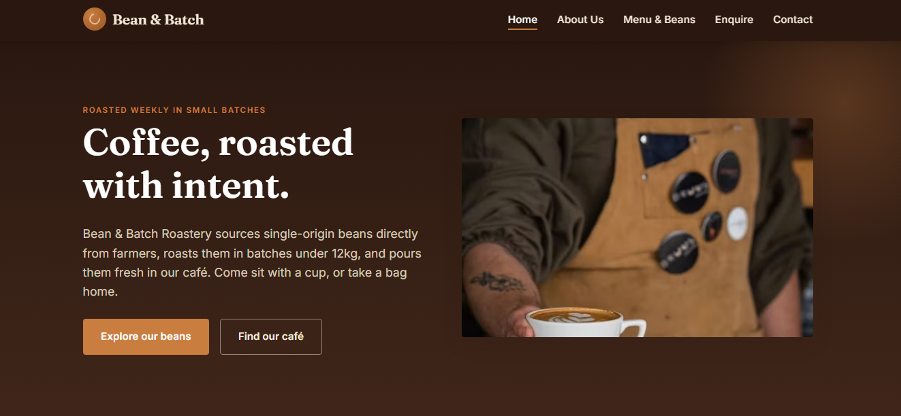
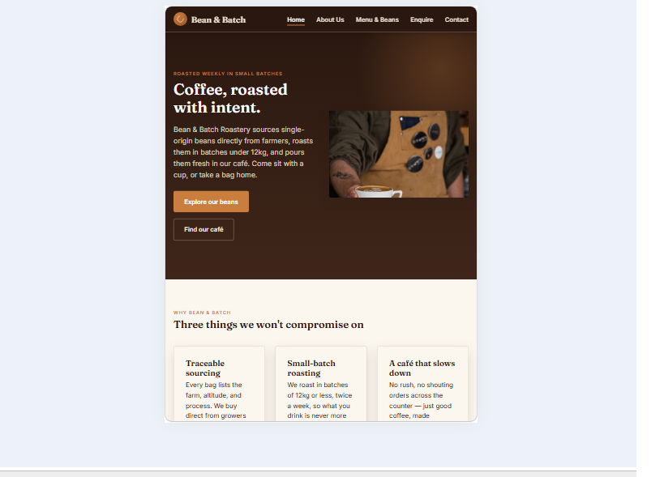
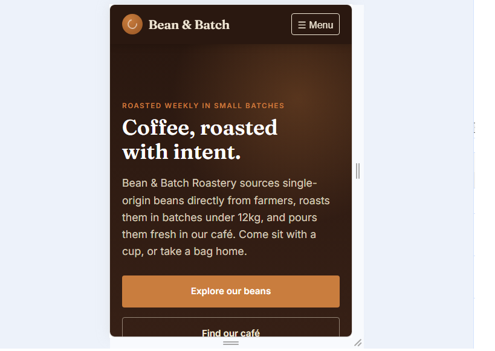

# Bean & Batch Roastery — Website Project

## Project Title
Bean & Batch Roastery Website (WEDE5020 Portfolio of Evidence)

## Student Information
- Name: [Khuziwe Theo Mahlangu]
- Student Number: ST10480653
- Module: WEDE5020
- Group/Class: 4

## Project Overview
A five-page marketing and lead-generation website for Bean & Batch Roastery, a
small-batch specialty coffee roaster and café. The site introduces the brand,
lists coffee and menu offerings, and gives customers, wholesale partners, and
event clients a way to get in touch.

## Website Goals and Objectives
- Provide a professional, always-on presence beyond social media.
- Communicate sourcing, roasting, and product information clearly.
- Generate wholesale, catering, and general product enquiries.
- Make store hours and locations easy to find.

## Key Features and Functionality
- Responsive 5-page site: Home, About Us, Menu & Beans, Enquiry, Contact.
- Sticky, accessible navigation with a mobile toggle menu.
- Enquiry form with an enquiry-type selector (product / wholesale / catering).
- Contact page with two locations, embedded maps, hours, and a message form.
- Custom "roast meter" component showing where each bean sits from light to
  dark roast.

## Timeline and Milestones
See `Website_Project_Proposal_BeanAndBatchRoastery.docx`, Section 7, for the
full timeline. Milestones follow the module's Part 1–3 submission schedule.

## File Structure
```
bean-and-batch-roastery/
├── index.html
├── about.html
├── products.html
├── enquiry.html
├── contact.html
├── css/
│   └── style.css
├── js/
│   └── main.js
└── images/
    ├── hero-coffee-480.jpg / -800.jpg / -1200.jpg
    └── beans-480.jpg / -800.jpg / -1200.jpg
    (placeholder images — swap for real sourced/original photography
    before final submission; see content-research-and-sourcing.md)
```

## Sitemap
```
Home (index.html)
├── About Us (about.html)
├── Menu & Beans (products.html)
├── Enquire (enquiry.html)
└── Contact (contact.html)
```

## Changelog

### Part 1
| Date | Change |
|------|--------|
| [add original date] | Initial project structure, sitemap, and wireframes created; file/folder structure set up (index, about, products, enquiry, contact pages plus css/js/images folders). |
| [add original date] | Semantic HTML5 structure and content added for all 5 pages (header, nav, main, section, footer; forms on Enquiry and Contact). |
| [add original date] | Repository committed and pushed to GitHub with initial README. |

### Part 2 — Feedback corrections from Part 1
| Date | Change |
|------|--------|
| 2026-09-16 | **Sitemap**: confirmed the Sitemap section below is complete and kept up to date (flagged as missing in Part 1 feedback). |
| 2026-09-16 | **References**: expanded the References section with full, correctly formatted entries for every external source used (fonts, image placeholders, documentation) — Part 1 had none recorded. |
| 2026-09-16 | **Content research**: reviewed and tightened `content-research-and-sourcing.md` so each page's content sourcing is clearly explained and directly relevant to the Bean & Batch brand. |
| 2026-09-16 | **Commit practice**: moving forward, committing smaller, descriptive changes (see commit history) instead of large infrequent commits, to address "few commits, lacking descriptions" feedback. |

### Part 2 — CSS styling and responsive design
| Date | Change |
|------|--------|
| 2026-09-16 | Added `css/style.css`, linked to all 5 HTML pages, with CSS custom properties for a consistent colour palette, spacing, and border-radius. |
| 2026-09-16 | Established base styles: font families (Fraunces/Inter via Google Fonts), base font sizing with `clamp()`, line-height, and a `box-sizing: border-box` reset. |
| 2026-09-16 | Applied typography styles (font-weight, letter-spacing, an "eyebrow" label style) for a consistent type scale across pages. |
| 2026-09-16 | Built page layouts with CSS Grid (`.grid`, `.grid-2`, `.grid-3`) and Flexbox (header, nav, hero actions, footer bottom). |
| 2026-09-16 | Applied visual styling — colour, background, border, box-shadow on cards/forms — and interactive states using `:hover`, `:focus-visible`, and `:active` on nav links, buttons, and form fields. |
| 2026-09-16 | Implemented three-tier responsive design: desktop (1025px+), tablet (761–1024px, added this update), and mobile (≤760px) breakpoints via media queries, switching the grid layouts from multi-column to single-column and turning the nav into a mobile toggle menu. |
| 2026-09-16 | Used relative units (`rem`, `em`, `%`, `vw`, `clamp()`) throughout for font sizes and spacing instead of fixed pixel values, so the layout scales smoothly between breakpoints. |
| 2026-09-16 | Added responsive images: a `<picture>` element with `srcset`/`sizes` on the Home page hero (art-directed crop for mobile vs desktop) and an `` example on the Menu & Beans page, so browsers load an appropriately sized image per device. Images are placeholders — see `content-research-and-sourcing.md` for the real photography to source before final submission. |
| 2026-09-16 | Tested the site at desktop, tablet, and mobile widths using browser DevTools' device toolbar; screenshots added to the "Responsive Testing Evidence" section below. |

## Responsive Testing Evidence
Tested using browser DevTools' device toolbar (Chrome/Edge) at the following
widths, representing the three breakpoints defined in `css/style.css`:
- Desktop — 1280px and 1440px
- Tablet — 820px (iPad) and 1024px
- Mobile — 375px (iPhone) and 360px (Android)





## References
References used for this document and general project research are compiled
here; page-specific references (images, fonts, icons) are also noted where
used in the HTML comments.

- Google Fonts. (2026). *Fraunces & Inter*. Available at: https://fonts.google.com/ (Accessed: 16 September 2026).
- MDN Web Docs. (2026). *CSS Grid Layout*. Available at: https://developer.mozilla.org/en-US/docs/Web/CSS/CSS_grid_layout (Accessed: 16 September 2026).
- MDN Web Docs. (2026). *Responsive images*. Available at: https://developer.mozilla.org/en-US/docs/Web/HTML/Responsive_images (Accessed: 16 September 2026).
- MDN Web Docs. (2026). *Using media queries*. Available at: https://developer.mozilla.org/en-US/docs/Web/CSS/CSS_media_queries/Using_media_queries (Accessed: 16 September 2026).
- MDN Web Docs. (2026). *HTML forms guide*. Available at: https://developer.mozilla.org/en-US/docs/Learn/Forms (Accessed: 16 September 2026).
- W3Schools. (2026). *CSS Flexbox*. Available at: https://www.w3schools.com/css/css3_flexbox.asp (Accessed: 16 September 2026).
- GitHub Pages Documentation. (2026). Available at: https://pages.github.com/ (Accessed: 16 September 2026).
- Unsplash / Pexels. (2026). Royalty-free stock photography, to be sourced for final product/hero imagery (see `content-research-and-sourcing.md`). Available at: https://unsplash.com/ and https://pexels.com/.


